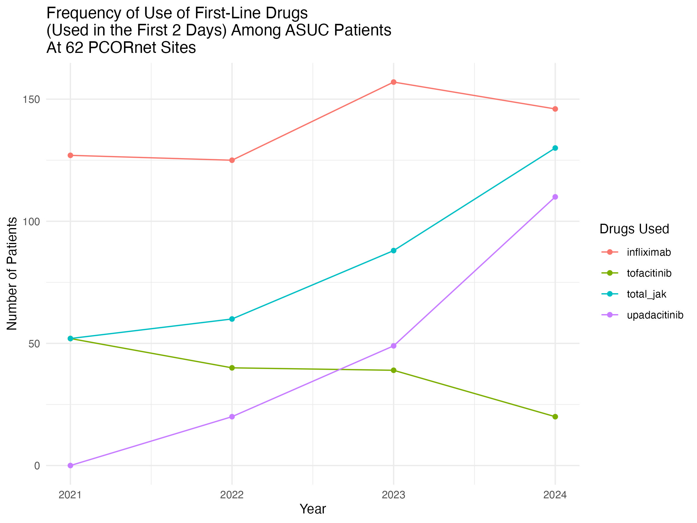
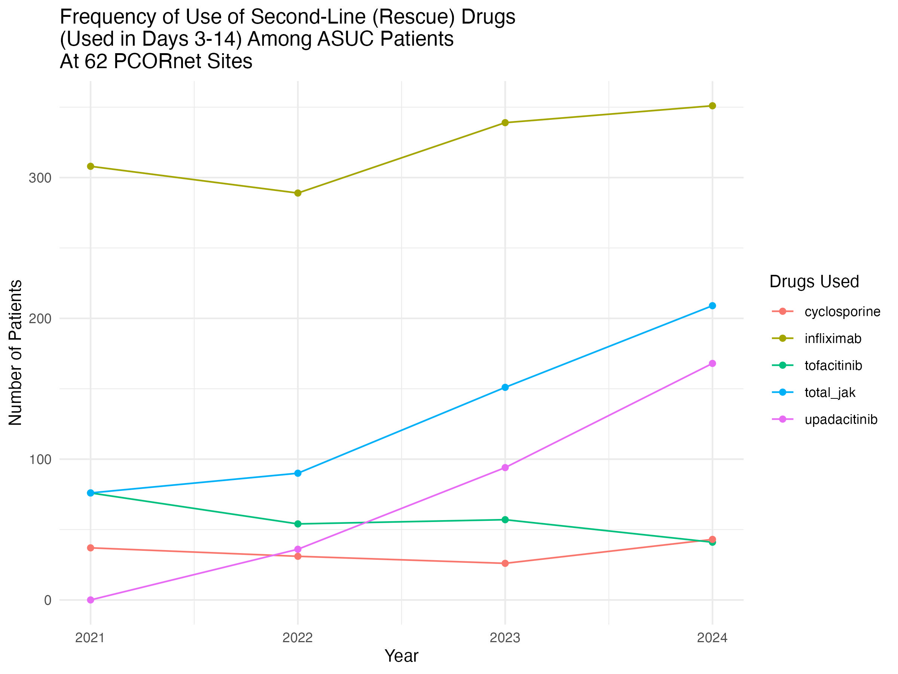

```{r setup, include=FALSE}
#| echo: false
library(here)
library(tidyverse)
library(knitr)
library(gt)
library(readxl)
```

## Intro

While guidelines are frequently out of date by the time they are published, it is important to review published guidelines in relation to what physicians are actually doing to treat patients. A recent ACG guideline on ulcerative colitis was published in 2025, which included an extensive section on the treatment of Acute Severe Ulcerative Colitis (ASUC). This guideline recommends first line intravenous corticosteroids, with rescue if needed with 2nd line infliximab or cyclosporine after evaluation after 72 hours of treatment.

Published medical guidelines are notoriously "out of date by the time they are published", in part because of the development time of comprehensive guidelines, the rapid pace of change in medical research, and limited resources to update guidelines. Guidelines quickly become outdated (REF 1. CMAJ. 2014 Nov 4;186(16):1211–1219. doi: [10.1503/cmaj.140547](https://doi.org/10.1503/cmaj.140547),\
\
2. Woolf SH, Grol R, Hutchinson A, Eccles MP, Grimshaw J. Clinical guidelines: potential benefits, limitations and harms of clinical guidelines. *BMJ.* 1999;318:527-530.

3\. Shekelle PG, Ortiz E, Rhodes S, et al. Validity of the Agency for Healthcare Research and Quality Clinical Practice Guidelines: how quickly do guidelines become outdated? *JAMA.* 2001;286:1461-1467.)

We compared this guidance with what is actually being done for patients with ASUC at 62 PCORNet centers around the US. PCORnet is a national network of medical systems, funded by the Patient Centered Outcomes Research Institute (PCORI), that enables insights from high-quality health data from centers across the US.

We hypothesized that (1) advanced therapies are being used as first line therapy upon ASUC hospitalization, (2) the use of cyclosporine relative to infliximab for ASUC rescue is quite low, and (3) the use of first line and rescue JAK inhibitors is on the rise, and for first-line ASUC therapy, may approach the usage rate of infliximab.

## Methods

We aquired data from 62 PCORNet centers as part of a Query in Preparation for Research in August 2025, covering 2021-2024. Per PCORNet policy, any cells with fewer than 11 patients are reported as "\<11" to minimize the risk of inadvertently making patients identifiable.

For the purposes of this administrative data query at 62 PCORNet sites, ASUC was defined as a hospital admission with a primary diagnosis of ulcerative colitis and receiving steroids within the first 48 hours of admission. The final report provides counts aggregated across 62 DataMarts. Four calendar-year cohorts were created coinciding with an inpatient ASUC Dx in the years 2021-2024. The Health Event of Interest (HEI) for all cohorts is the earliest qualifying inpatient UC Dx in in EI or IP care setting a calendar year for years 2021-2024. Patients were allowed to qualify for more than one calendar-year cohort, but not for more than one admission for ASUC per year. The first admission in a calendar year was chosen for the annual cohort. Age was calculated on the date of the HEI, and is binned by decade of age.

Queries evaluated whether tofacitinib, upadacitinib, infliximab, or cyclosporine were used in the first 14 days after hospital admission, and divided this time period into first-line therapy (in days 0-2) and maintenance or rescue therapy (days 3-14) for the JAK inhibitors and infliximab. Additionally, all cohorts were characterized for colectomy surgery in the year following the HEI. Electronic Health Record (EHR) data may not capture all elements of a patient care within a given health system. As a result, misclassification may occur and data should be interpreted with this limitation in mind.

## Results

### Descriptive Table 1

```{r}
#| echo: false
tab1 <- read_xlsx("fd2396_ASUC_final_report.xlsx", sheet = "Tab1") |>
  unite(2:3, col = "Y2024", sep = " (") |>
  mutate(
    Y2024 = str_replace(Y2024, "NA", ""),
    Y2024 = str_trim(Y2024),
    Y2024 = paste0(Y2024, ")")
  ) |>
  unite(3:4, col = "Y2023", sep = " (") |>
  mutate(
    Y2023 = str_replace(Y2023, "NA", ""),
    Y2023 = str_trim(Y2023),
    Y2023 = paste0(Y2023, ")")
  ) |>
  unite(4:5, col = "Y2022", sep = " (") |>
  mutate(
    Y2022 = str_replace(Y2022, "NA", ""),
    Y2022 = str_trim(Y2022),
    Y2022 = paste0(Y2022, ")")
  ) |>
  unite(5:6, col = "Y2021", sep = " (") |>
  mutate(
    Y2021 = str_replace(Y2021, "NA", ""),
    Y2021 = str_trim(Y2021),
    Y2021 = paste0(Y2021, ")")
  ) |> 
  gt()

tab1
```

2.  Cases of ASUC - how many: 4901 unique, how many with methylprednisolone 3,744, prednisone 1,632 (significant overlap/conversion to oral) in 2024

3.  What is colectomy rate at same hospital within 2, 90, or 365 days of HEI admission?

    d0-2 is 82/4901

    d3 - 90 is 167/4901

    d 91-365 is 62/4901

4\. How many total received in days 1-14?

IFX 372, Cyclo 43 in 2024

5\. How many received IFX rescue (d 3-14)?\
IFX rescue 351, Upa 168, tofa 41 (total JAK 209 - note up to 130 of JAK may be continuation of first line Rx) - total of 560 between JAKi and IFX. Relatively - Cyclo is 43/603 - 7% of rescue

6\. Was IFX used first line?

\- in 146, tofa - 20, Upa 110 (total JAKi 130). First line JAKi is being used, as is first line IFX.

7.  What is the rate of change in first line therapy use 2021-2024?

    Rising fast, rising proportion of JAK

    Period 1 (Days 0-2)

```{r}
#| echo: false
 
```

8.  What is the rate of change in 2nd line (rescue) therapy in 2021-2024

    Stagnant cyclo, stable slowly rising IFX, rapidly rising JAKi (though many may be continuing dosing from 1st line)

    Period 2 (Days 3-14)

```{r}
#| echo: false

```

## Discussion

Guidelines say - steroids first line, consider rescue with Cyclo of IFX JAKi not ready for use.

No specific mention of first line advanced therapy

But IFX is known to leak in ASUC - documented leak measurable in stool. Early anti-IFX abs and low trough levels are common in ASUC JAKi are small molecules, not proteins, so no leak, no abs

### What is actually being done in centers around the US?

Both IFX and JAKi are being used as first line therapy in a minority of patients

Rising use of JAKi first line, approaching IFX use

Cyclo use is very low, either for first line or rescue, \< 1% of patients

Colectomy rates are low in this dataset

### Limitations

Administrative data, misclassification possible

Data only from 62 PCORNet centers, may not be generalizable, but generally reflects the demographics of the US population
